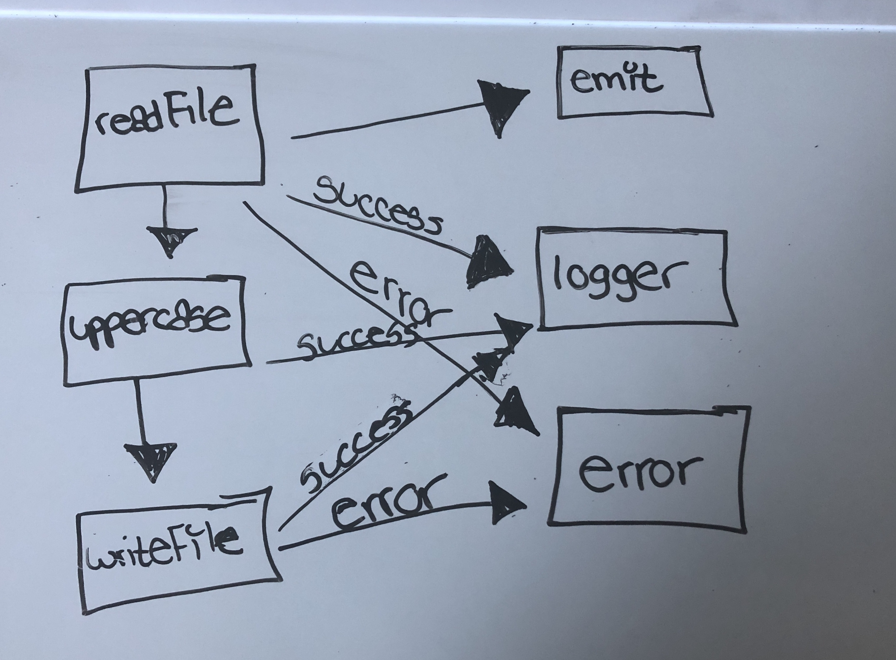

# LAB - 16

## Project Name
Event Driven Applications

### Author: Tia Rose

### Links and Resources
* [submission PR](https://github.com/tia-rose-401-advanced-javascript/lab-16/pull/1)
* [travis](https://www.travis-ci.com/tia-rose-401-advanced-javascript/lab-15)

#### Documentation
* [jsdoc](localhost:3000/docs/global.html) or open index.html file  found in the files docs directory

Exported Values and Methods

### Setup

Running the app

`npm start`

### Tests
How do you run tests?

`npm test`

#### UML
